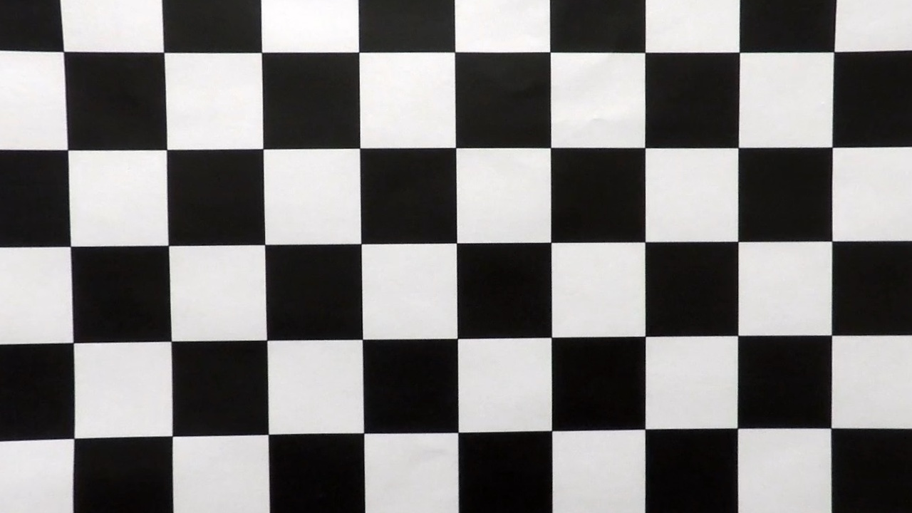
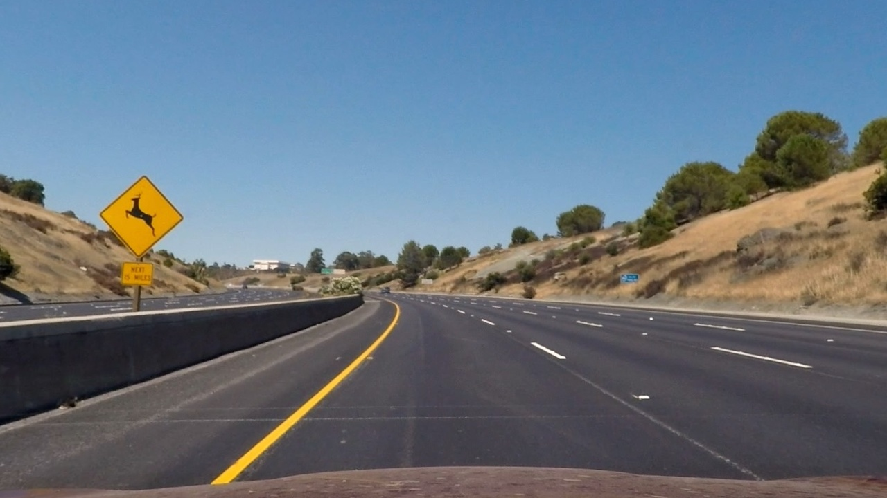
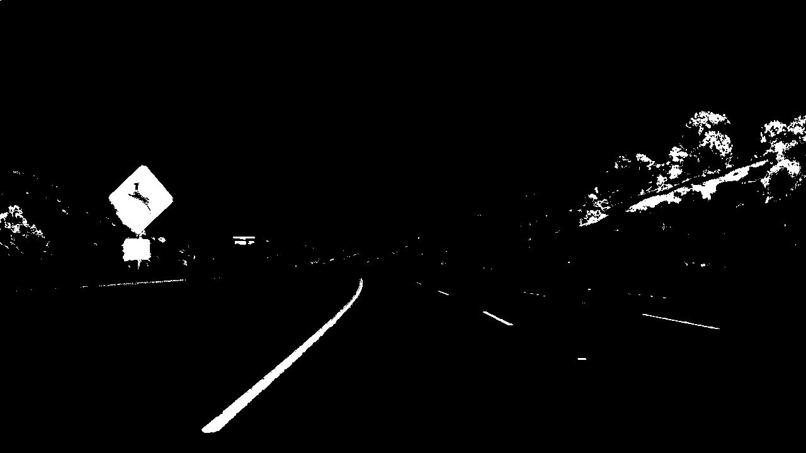
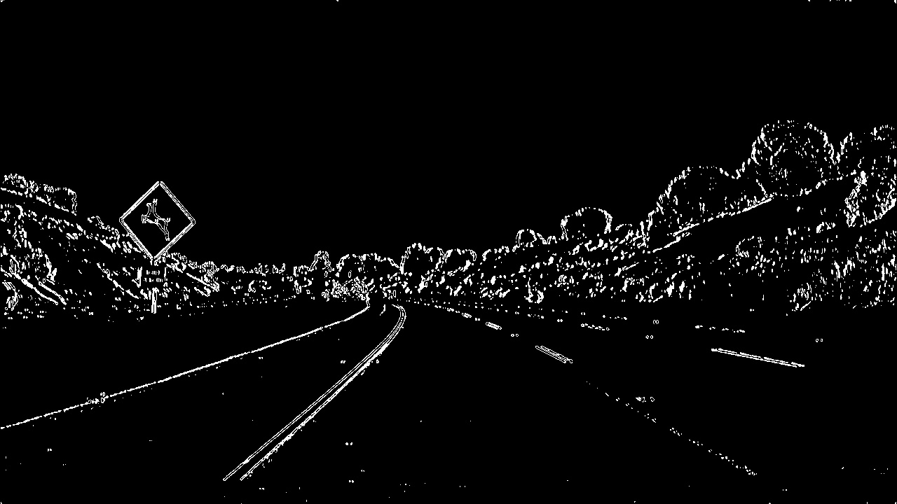
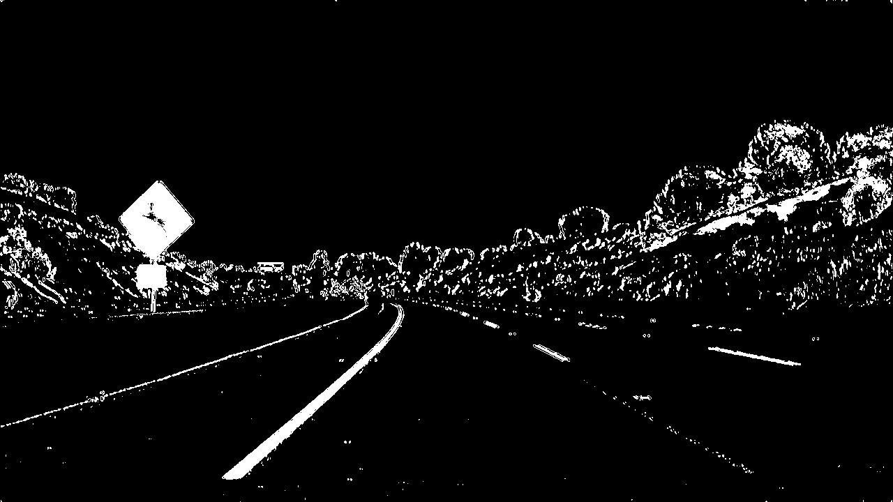
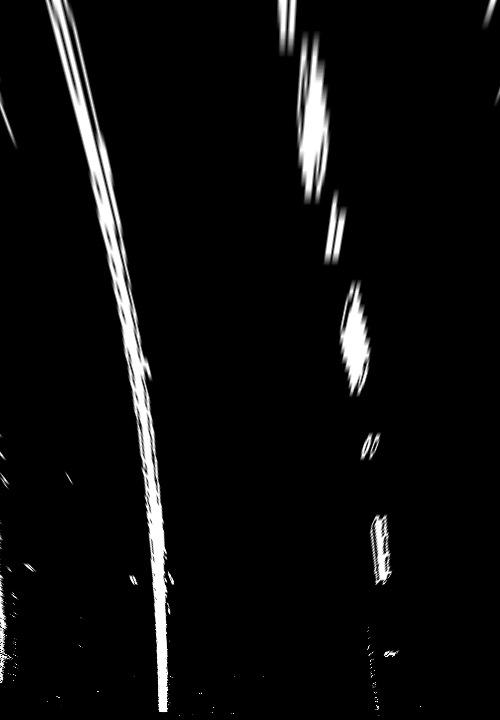
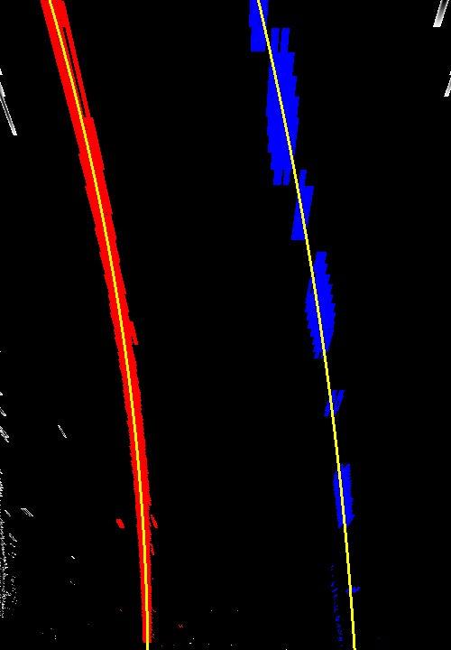
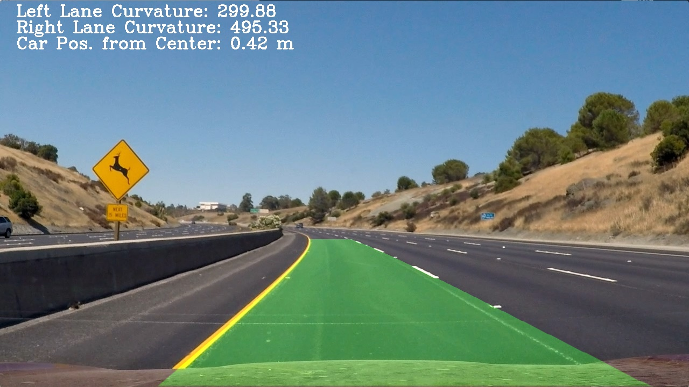
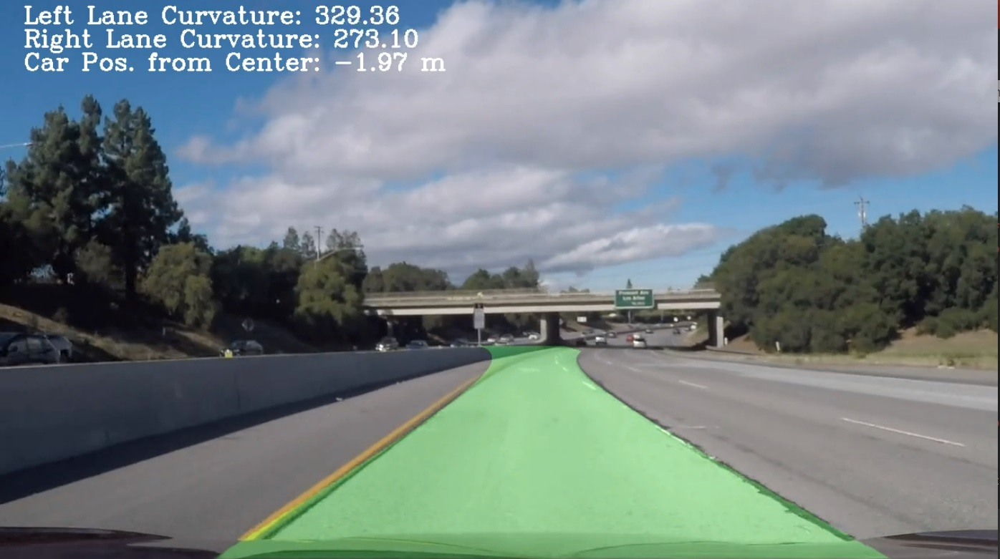

**Advanced Lane Finding Project**

The goals / steps of this project are the following:

* Compute the camera calibration matrix and distortion coefficients given a set of chessboard images.
* Apply a distortion correction to raw images.
* Use color transforms, gradients, etc., to create a thresholded binary image.
* Apply a perspective transform to rectify binary image ("birds-eye view").
* Detect lane pixels and fit to find the lane boundary.
* Determine the curvature of the lane and vehicle position with respect to center.
* Warp the detected lane boundaries back onto the original image.
* Output visual display of the lane boundaries and numerical estimation of lane curvature and vehicle position.

## [Rubric](https://review.udacity.com/#!/rubrics/571/view) Points

---

### Camera Calibration

#### 1. Briefly state how you computed the camera matrix and distortion coefficients. Provide an example of a distortion corrected calibration image.

The code for this step is contained `calibration.py`  
I start by preparing "object points", which will be the (x, y, z) coordinates of the chessboard corners in the world. Here I am assuming the chessboard is fixed on the (x, y) plane at z=0, such that the object points are the same for each calibration image.  
Thus, `objp` is just a replicated array of coordinates, and `objpoints` will be appended with a copy of it every time I successfully detect all chessboard corners in a test image.  `imgpoints` will be appended with the (x, y) pixel position of each of the corners in the image plane with each successful chessboard detection.  


I then used the output `objpoints` and `imgpoints` to compute the camera calibration and distortion coefficients using the `cv2.calibrateCamera()` function.  I applied this distortion correction to the test image using the `cv2.undistort()` function and obtained this result:

|Input|Output
|:-:|:-:
|  | 

### Pipeline (single images)

#### 1. Provide an example of a distortion-corrected image.

To demonstrate this step, I will describe how I apply the distortion correction to one of the test images like this one:

|Input|Output
|:-:|:-:
|  | 

#### 2. Describe how (and identify where in your code) you used color transforms, gradients or other methods to create a thresholded binary image.  Provide an example of a binary image result.

I used a combination of color and gradient thresholds to generate a binary image (thresholding steps at lines #30 through #33 in `main.py`, which uses `SobelThreshold` class and `SobelThreshold` class in `threshold.py`).  Here's an example of my output for this step.

|Color Thresholding|Sobel Thresholding
|:-:|:-:
|  | 

|Combined Output
|:-:
| 

#### 3. Describe how (and identify where in your code) you performed a perspective transform and provide an example of a transformed image.

The code for my perspective transform includes a function called `warp()`, which appears in lines #29 through #30 in the file `lane_detector.py`.  
The `warp()` function takes as inputs an image (`img`).  Instance of 'LaneDetector' class has the matrix needed for warp transformation, and the matrix is calculated in `set_transform_matrix` (line #25). I chose the hardcode the source and destination points in the following manner:

```python
w = 1280
h = 720
dst_w = 500
t_y = 445
t_x_diff = 85
b_x_diff = 1000

src = np.float32([
    [w/2 - t_x_diff, t_y],
    [w/2 - b_x_diff, h],
    [w/2 + b_x_diff, h],
    [w/2 + t_x_diff, t_y]])
dst = np.float32([[0, 0], [0, h], [dst_w, h], [dst_w, 0]])
```

This resulted in the following source and destination points:

| Source        | Destination   |
|:-------------:|:-------------:|
| 555, 445      | 0, 0        |
| -360, 720     | 0, 720      |
| 1640, 720     | 500, 720      |
| 725, 445      | 500, 0        |

I verified that my perspective transform was working as expected by drawing the `src` and `dst` points onto a test image and its warped counterpart to verify that the lines appear parallel in the warped image.



#### 4. Describe how (and identify where in your code) you identified lane-line pixels and fit their positions with a polynomial?

This process is consisted of below 3 steps. I did this in `lane_detector.py`

1. Determine the starting point (left side and right side) to search the line from.

```py
# L55 - 58
histogram = np.sum(binary_warped[binary_warped.shape[0]//2:,:], axis=0)
midpoint = np.int(histogram.shape[0]//2)
x_base = { 'left': np.argmax(histogram[:midpoint]),
           'right': np.argmax(histogram[midpoint:]) + midpoint }
```

2. Sliding the window, and search the continuous line.

```py
# L68 - 83
for window in range(self.nwindows):
    win_y_low = binary_warped.shape[0] - (window+1)*window_height
    win_y_high = binary_warped.shape[0] - window*window_height

    for label in LABELS:
        win_x_low = x_current[label] - self.margin_first
        win_x_high = x_current[label] + self.margin_first

        good_inds = ((nonzeroy >= win_y_low) & (nonzeroy < win_y_high) &
                     (nonzerox >= win_x_low) & (nonzerox < win_x_high)
                    ).nonzero()[0]

        lane_inds[label].append(good_inds)

        if len(good_inds) > self.minpix:
            x_current[label] = np.int(np.mean(nonzerox[good_inds]))
``` 

3. Polynomial fitting

```py
# L132 - 133
for label in LABELS:
    self.fit[label] = np.polyfit(y[label], x[label], 2)
```

Then I did some other stuff and fit my lane lines with a 2nd order polynomial kinda like this:



If lane has been fonud already, we can search lane from around the found lane. Therefore, logic and code become more simple as below (Step 1 and 2 are substituted).

```py
def find_lane_pixels_around_before(self, binary_warped):
    nonzero = binary_warped.nonzero()
    nonzeroy = np.array(nonzero[0])
    nonzerox = np.array(nonzero[1])

    x, y = {}, {}
    for label in LABELS:
        x[label], y[label] = self.get_xy2(nonzerox, nonzeroy, self.fit[label])

    return x, y
```

#### 5. Describe how (and identify where in your code) you calculated the radius of curvature of the lane and the position of the vehicle with respect to center.

I did this in lines #107 through #124 in my code in `lane_detector.py`


```py
def get_curvature(self, x, y, ploty):
    ym_per_pix = 30/720
    xm_per_pix = 3.7/700
    y_eval = np.max(ploty)
    
    scene_w = w * xm_per_pix
    scene_h = h * ym_per_pix
    
    curverad, intercept = {}, {}
    for label in LABELS:
        fit_cr = np.polyfit(y[label]*ym_per_pix, x[label]*xm_per_pix, 2)
        curverad[label] = ((1 + (2*fit_cr[0]*y_eval*ym_per_pix + fit_cr[1])**2)**1.5) / np.absolute(2*fit_cr[0])
        intercept[label] = fit_cr[0]*scene_h**2 + fit_cr[1]*scene_h + fit_cr[2]
        
    center = (intercept['left'] + intercept['right'])/2.0
    car_pos = center - scene_w/2.0

    return curverad, car_pos
```

#### 6. Provide an example image of your result plotted back down onto the road such that the lane area is identified clearly.

I implemented this step in lines #168 through #177 in my code in `lane_detector.py` in the function `process()`. 

```py
zeros = np.zeros_like(binary_warped)
warped_lane = np.dstack((zeros, zeros, zeros))

pts_left = np.array([np.transpose(np.vstack([fitx['left'], ploty]))])
pts_right = np.array([np.flipud(np.transpose(np.vstack([fitx['right'], ploty])))])
pts = np.hstack((pts_left, pts_right))
cv2.fillPoly(warped_lane, np.int_([pts]), (0, 255, 0))
lane_img = self.unwarp(warped_lane)

output = cv2.addWeighted(img, 1.0, lane_img, 0.3, 0)
```

Here is an example of my result on a test image:



---

### Pipeline (video)

#### 1. Provide a link to your final video output.  Your pipeline should perform reasonably well on the entire project video (wobbly lines are ok but no catastrophic failures that would cause the car to drive off the road!).

Here's a [link to my video result](./output_videos/project_video.mp4)

---

### Discussion

#### 1. Briefly discuss any problems / issues you faced in your implementation of this project.  Where will your pipeline likely fail?  What could you do to make it more robust?

The big problem is robustness. For example, when my pipeline is applied to `challenge_video.mp4`, it dose not go well. In paticular, left line swerve to the left, because a 'similar' white line is in the left also.



To such probelm, the following solution may do well.

- From center, farther lines are ignored and the nearest line is adopted.
- Enhancement of filtering by color or sobel or something else.
- Suppose the slope of lane line does not change so much and use the fact.
